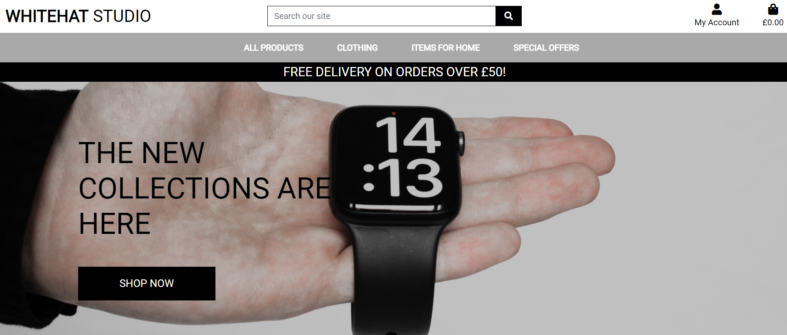

Whitehat Studio
---
## Table of Contents

- [**About**](#About)
- [**UX**](#UX)
    - [Goals](#Goals)
    - [User Stories](#User-Stories)
    - [Styling](#Styling)
    - [Wireframes](#Wireframes)
- [**Features**](#Features)
    - [Existing Features](#Existing-Features)
    - [Potential Future Features](#Potential-Future-Features)
- [**Technologies Used**](#Technologies-Used)
- [**Testing**](#Testing)
- [**Code Validation**](#Code-Validation)
- [**Deployment**](#Deployment)
    - [Live Website](#Live-Website)
    - [Repository Link](#Repository-Link)
    - [Running Code Locally](#Running-Code)
    - [Deploying to Heroku](#Deploying-to-Heroku)
    - [Deploying Static Files to AWS](#Deploy-to-aws)
- [**Credits**](#Credits)

---

## About

I have created this shopping app is for multiple reasons, the first being I wanted customers to want to use this as a service for their own needs. Using me for managing and creating their stores based on their needs. 

Another reason is online web stores are much needed and is used in interviews for web positions. 

---

## UX

### Goals 

The goals of this web store are: 
1. For potential customers to want to use this store as a template for their own needs.
2. The website must have a way for users to be able to edit and/or delete products.
3. The website must have a backend for authorised users to add categories and products whenever necessary.

---

### User Stories 

From the shoppers point of view: 
- The shopper must be able to view a list of products, and select items to purchase.
- The shopper must be able to view individual products and identify the price easily. 
- The shopper must be able to sort through the products in different formats - ratings, price and categories.
- The shopper must be able to search the store for a specific product(s). 

From the site user's point of view: 
- The site user must be able to register for an account and receive email confirmations.
- The site user must be be able to log into the store and sign out with the piece of mind that their information is secure.
- The site user must be able to recover their own password without the need of assistance from the store in case it's forgotten.

From the store owner's point of view:
- The owner must be able to add a product (or multiple) with the ability to add product descriptions, price and images.
- The owner must be able to edit and update a product to reflect promotions or clearance.
- The owner must be able to delete any products they need too, whether this is due to an error in the product or they no longer want to stock that item. 

---

### Styling

The store must be easy to read and use whilst ensuring that all functions are readable to all users. I have used a plain black and white theme in the store whilst using different colours for key functions like the "edit" and "delete" buttons on the products page (if authorised to view these). 

For the font, I have used Google Font's Roboto with Sans Serif as the backup just in case Google Font's does not load. 

---

### Wireframes
Wireframes - [Wireframes]

---

## Features

### Existing Features

- The navigation menu shows towards the top of the screen with the links in a horizontal format with the sub links showing once clicked. This will then shrink to a hamburger icon on smaller screens showing on the left hand of the screen.
- Users will be able to log in and out using the person icon in the top right side of the screen. Authorised users will be able to see "Product Management" in the same section.
- Users are able to sort the items based on different requirements.
- Users are able to see toast messages when different actions are completed - these range for adding articles to their bag, editing products or removing items from their bag. 

### Features Left to Implement

- Articles to be stored in a database, whether MongoDB or SQL, instead of statically on the website itself. 
- Text Message notifications - for delivery confirmation or tracking. 
- Improve the speed of the website.
- Change the main currency for the Django from USD to GBP, I have started on this by ensuring that all manually written "$" is replaced with "£". 
- Ensuring that all images are the same size, this would be doable when using real life images.

---

## Technologies Used
- Python 
	- Django 
		- Django was used as the main web framework.
	- DotEnv
		- DotEnv was used to store variables in replacement of using GitPod's builtin. 
	- Crispy Forms
		- CF was used to make forms cleaner and allow me to control the behavior better.
	- All Auth
		- AA was used for security and allow users to sign in. 
	
- HTML
    - HTML was used for the main structure of the website.

- CSS
    - CSS was used to style and change sizes and positions of different items where Bootstrap was not able too or enhancing the styling that Bootstrap used.

- JQuery
    - JQuery was used for Bootstrap features and other features that needed javascript functions. 
	
- Google Chrome
	- Chrome inspect and developer tool was used for testing the store on different devices.

- Google Fonts 
	- Google Fonts was used for the main font of the store.

- Font Awesome
	- Font Awesome was used for the icons for the different 

- Bootstrap
	- Bootstrap 
		- This was used as a front-end framework.
	- Bootstrap Toasts
		- This was used to convey messages to the user from the system, i.e. allowing for notifications when something is added to the basket. 

- Stripe
	- Stripe was used for allowing customers to checkout once they have finished shopping.

---

## Testing

### Main Testing

Throughout the entirety of the creation of the store, I have been testing the store in a web browser testing all of the functions and features that I have added correcting issues as I go.

### Responsive Testing 

To check how the store ran and looked on different devices, I inspected the store in Google Chrome. When pushed to Heroku, I also tested the store on other devices (iPhone, Firefox, Wide Screen Monitor, etc). 

Through the testing, I was ensuring that the navigation bar, hamburger icon and articles were displaying how they should. 

### Additional Testing 

I also carried out testing on the following: 
- Creating users, products and categories to ensure that there were no issues if released to the public.
- Checking out, I ensure that I was able to checkout correctly (before deploying) using Stripe's 4242... test card. 
- Editing products to ensure that whatever was updated was displayed after clicking save.
- Deleting products to ensure that they would disappear from the store as well as the backend.

### Code Validation
- W3C Markup Validation was used for HTML.
- W3C CSS Validation was used for validation my own CSS code. 
- Code Beautify Python Formatter was used for validation my own Python code.

---

## Deployment

### Live Website Link
https://whitehat-studio.herokuapp.com/

### Repository Link
https://github.com/DrogrinHunter/whitehat-studio

### Running Code Locally

To deploy the project, the following is required: 
- Python3
- Github account
- Heroku account

To create a clone of the project, follow the below: 
1. Login into GitHub and browse to the specified URL.
2. Click Code and open with GitHub Desktop.
3. Follow the prompts in the GitHub Desktop Application.

## Deploying to Heroku

Heroku allows us to host Python projects which can have more features than static sites which is what GitHub allows however we will deploy all the static and media files to Amazon Web Services (AWS).

### Creating Heroku App
1. Create an account on www.Heroku.com.
2. After going through the account setup and signing in, you will be on the Heroku dashboard.
3. You can click your chosen development language, Heroku will provide some helpful tips and tutorials about how to use it with Heroku.
4. From the dashboard, click "Create New App".
5. Enter a name for your app, it must be unique and only contain letters, numbers and hyphens. 
6. Choose a region that is closest to your Country. 
7. Create the app.

### Connecting Git repo to Heroku
1. At the top of the screen, find the "Deploy" tab.
2. Find "Deployment Method" and then "GitHub" from within the tab.
3. In the search bar, if you have multiple different repo's, search for the GitHub repo.
4. At this point, do not click "Enable Automatic Deployment" but instead click "Connect".

### Creating the Requirements.txt file
1. Heroku needs the requirements file so it knows what language is being used and the dependencies.
2. The quickest and easiest way to create this is to type, in the console: pip3 freeze --local > requirements.txt. 
3. Wait for Heroku to install what it needs to be able to run the project. From there, it will deploy to Heroku however if you try to open it then you will see an error - you will need to do the next step.

### Creating the Heroku Procfile
1. A Procfile is a specific file that Heroku uses in order to know how to run the project.
2. To create this, refirect an echo command by typing: echo web: python run.py > Procfile. *Please note - the capitalised P is crucial*.
3. Git add this, commit it with notes then push it GitHub. 

### Setting up the env.py file for the environment variables
1. Make sure to have created a .gitignore file and add the env.py file into it. 
2. The convention for the file holding the environment variables is "env.py".
3. In the env.py file, be sure to place the IP, PORT and any secret keys you are working with.

### Entering the variables into Heroku's config vars.
1. On the Project's Heroku page, go into the settings and scroll down to "config vars".
2. Add the information from your env.py files into the Heroku project - the reason for this is because the env.py file is not pushed to Heroku as it is ignored by the .gitignore files and GitHub / Heroku do not have access to this file which is vital for the running of the project.
3. Add the variables into the config vars as key-value pairs.
4. In the Heroku settings page, click "Enable Automatic Deployment". 
5. Under this section, in the "Manual Deploy" section choose the master branch of your project and click "Deploy Branch".
6. You will now be able to open the project via the "Open App" button.

## Deploying Static Files to AWS (Amazon Web Services)

1. Create a bucket in AWS S3 - ensuring that public access was **NOT** blocked.
2. Ensure that static website hosting was enabled.
3. Input a suitable CORS configuration. 
4. Create a suitable security policy that allows for public viewing.
5. Create a group that is named for this store and assign the new policy to it.
6. Create a user specifically for static files.
7. Configure Django to connect S3 using the keys that have been provided when creating the user. 
8. Input the relevant keys into the Config Vars in Heroku.

--- 

## Credits

### Code / Content

- I used the CSS Tricks website for the Triangle that allows users to go to the top of the screen. (https://css-tricks.com/snippets/css/css-triangle)
- Code Insitute for all auth updated templates.
- Code Insitute for django widget template.
- Code Insitute for deploying to AWS.
- Code Insitute for refactoring bag.html tutorial. 
- StackOverflow for various issues when writing queries in Python.
- I have used royalty free images from Unsplash (https://unsplash.com/)

### Acknowledgements

With thanks to Code Institute for the programme and the Boutique Ado project. The Slack community for the ability for me to search for issues that I have had with this project and allowing me to ask questions, whether minor or not. 